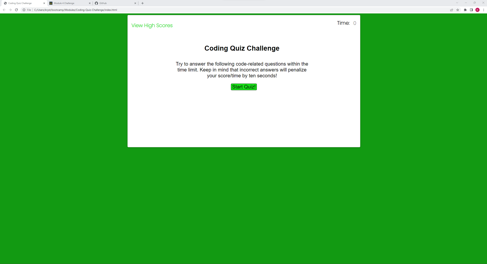
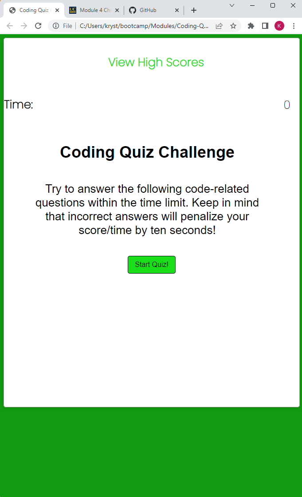
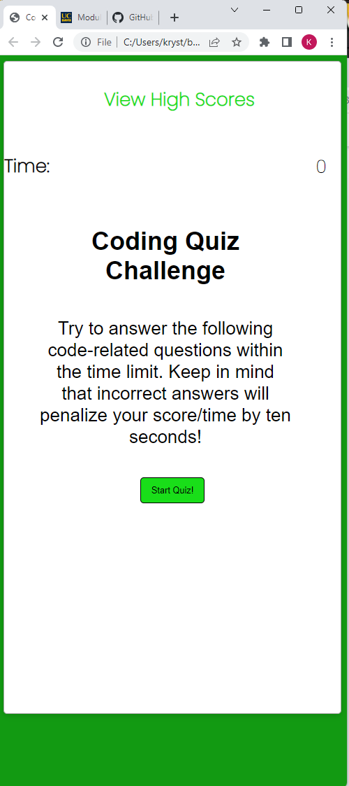

# Coding-Quiz-Challenge
## Code Quiz (Module 4 Challenge)

This website was created so that myself, or anyone else for that matter, can test some coding knowledge encompassing 10 questions each from CSS, HTML, and JavaScript. 

One only has to click the "Start Quiz" button on the screen. The user is then prompted to make a choice from a multiple answer selection for each question. It then follows by asking the remaining 29 questions in the quiz. If you answer a question incorrectly, then it shall subtract more time from the clock. Once you have input the answer for every question asked you have finished the quiz. If you ran out of time then in the instance as well you have finished the quiz. It then displays how many questions were answered correctly and prompts you to enter your initials.

## GIVEN I am taking a code quiz:

**WHEN** I click the start button

**THEN** a timer starts and I am presented with a question

**WHEN** I answer a question

**THEN** I am presented with another question

**WHEN** I answer a question incorrectly

**THEN** time is subtracted from the clock

**WHEN** all questions are answered or the timer reaches 0

**THEN** the game is over

**WHEN** the game is over

**THEN** I can save my initials and score

## Screenshots of deployed webpage

## Link to deployed webpage
https://kylekryst.github.io/Coding-Quiz-Challenge/

